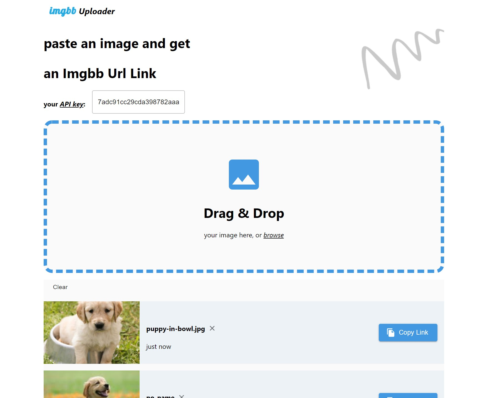

# imgbb-uploader

[**View App**](https://anisg.github.io/imgbb-uploader)

## Usage

### Available Scripts

| Script            | Description                                                                         |
| ----------------- | :---------------------------------------------------------------------------------- |
| `develop`         | Start the development server with hot module reloading.                             |
| `dev`             | Alias for `develop`.                                                                |
| `format`          | Format your code with Prettier.                                                     |
| `clean`           | Delete the `.cache` and `public` directories.                                       |
| `test`            | Run your Jest tests once.                                                           |
| `test:watch`      | Run your Jest tests in watch mode.                                                  |
| `lint`            | Lint your code with ESLint.                                                         |
| `lint:watch`      | Lint your code with ESLint in watch mode.                                           |
| `lint:fix`        | Lint your code with ESLint and attempt to fix linting issues.                       |
| `serve`           | Serve the production build of your site for testing.                                |
| `build`           | Compile your application and make it ready for deployment                           |
| `storybook`       | Starts Storybook.                                                                   |
| `build-storybook` | Compiles your stories and makes them ready for deployment.                          |
| `update`          | Updates the package.json to the latest dependency versions using npm-check-updates. |
